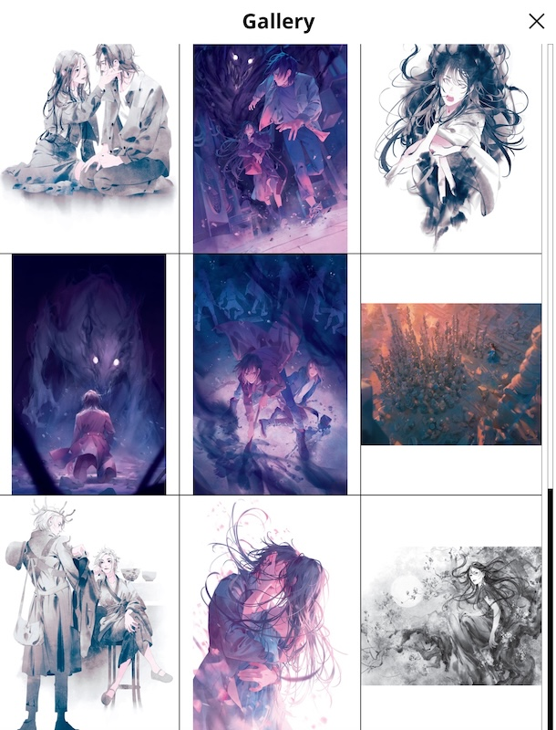
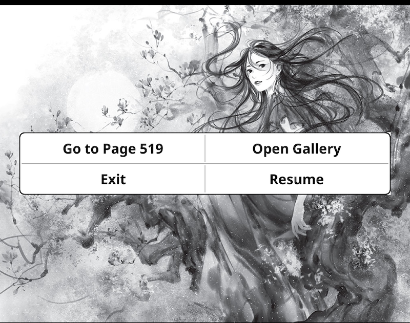
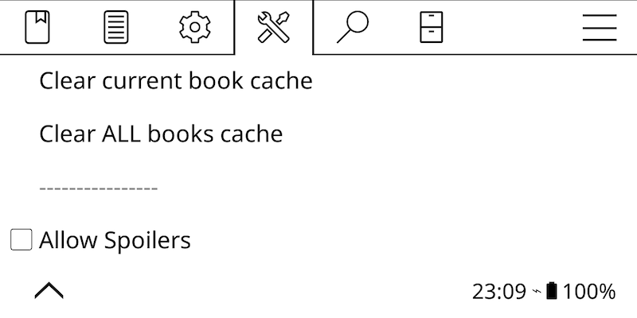
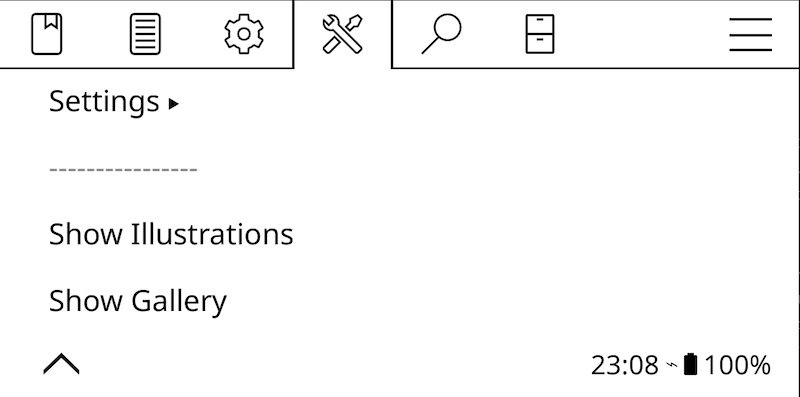

# Illustrations Plugin for KOReader

A plugin for [KOReader](https://github.com/koreader/koreader) that allows you to browse, preview, and navigate through all illustrations contained in an EPUB book.

<b>More Screenshots (Menu, Settings, Actions)</b>

| **Plugin Menu** | **Settings** |
| :---: | :---: |
|  |  |

| **Main Menu Entry** | **Gesture Actions** |
| :---: | :---: |
|  |  |

## Features

*   **Gallery Mode:** Browse all extracted images in a 3x3 grid view.
*   **Illustrations Mode:** View images one by one in full screen.
*   **Spoiler Protection:** By default, shows images **only up to the current page**. You can toggle "Allow Spoilers" in settings to see everything.
*   **Navigation:**
    *   **Touch:** Tap left/right to navigate, tap **top-center** to open controls.
    *   **Keys:** Supports physical page turn buttons and directional keys.
*   **Go to Page:** Jump directly from an image to its location in the book.
*   **Gesture Support:** Assign "Show Gallery" or "Show Illustrations" to any gesture in KOReader.
*   **Efficient Caching:** Images are extracted once and stored in the cache.

## Installation

1.  Download the latest release ZIP file from the [Releases page](../../releases).
2.  Connect your device to your computer via USB.
3.  Unzip the archive and copy the `illustrations.koplugin` folder into the `koreader/plugins/` directory on your device.
4.  Safely eject the device and restart KOReader.

## Usage

### Menu
Open a book, tap the top menu, and go to the **Tools** (wrench icon) tab. You will see a new **Illustrations** menu:

*   **Settings:**
    *   **Clear current book cache:** Removes extracted images for the current book.
    *   **Clear ALL books cache:** Removes all extracted images to free up space.
    *   **Allow Spoilers:** Toggle to show ALL images in the book (default is OFF).
*   **Show Illustrations:** Opens the single-image viewer.
*   **Show Gallery:** Opens the grid view of thumbnails.

### Controls (Single View)
*   **Next/Prev:** Tap right/left side or use keys.
*   **Menu:** Tap **top-center**.
    *   **Go to Page:** Jump to the book page.
    *   **Gallery:** Switch to grid view.
    *   **Resume:** Continue viewing.
    *   **Exit:** Close plugin.

### Gestures
You can assign actions in **Settings -> Taps & Gestures -> Gesture Manager**:
*   `Illustrations: Show Gallery`
*   `Illustrations: Show Illustrations`

## Storage
Extracted images are stored in `koreader/cache/illustrations/`.
